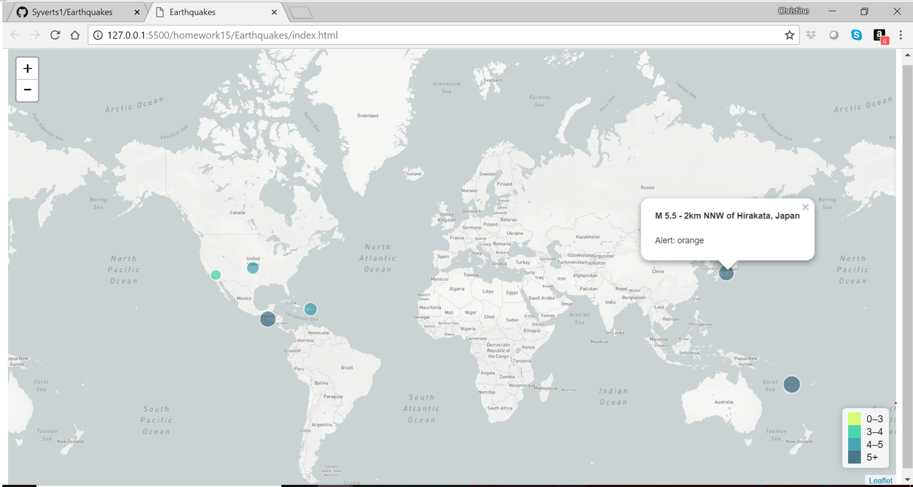

# Visualizing USGS Earthquake Data with Leaflet

This project involves taking earthquake data from the USGS API, and displaying it on a leaflet map. Specifically shown is significant earthquakes from the past month. A copy of the webpage (generate 6/25/18) is shown below:

